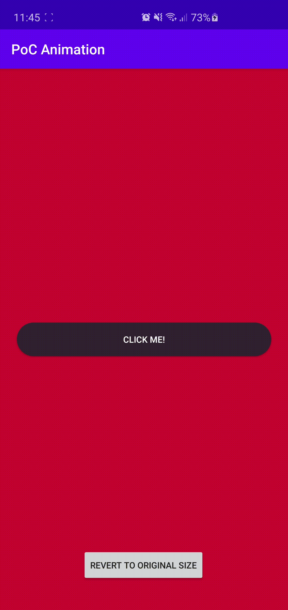

# Collpase Loading Button

Hi! This proof of concept (PoC) allowed me to improve my custom views skills. The button will collapse into circle and inside it will have an progress indeterminate bar.

## How to use?

I tried my best to simplefy all what i did, feel free to PR and improve with it :D

       toggleProgress(isLoading: Boolean)

